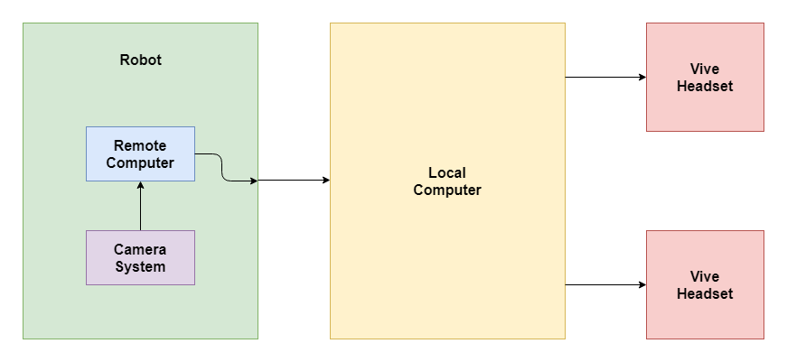

# ECE Senior Design Project
# High Quality Video Transmission for Virtual Reality

---

[](https://travis-ci.org/UTNuclearRoboticsPublic/ece-senior-design) [](https://opensource.org/licenses/BSD-3-Clause)

---

# Project Description

The goal of this project is to build a long distance virtual reality (VR) streaming system for the University of Texas at Austin [Nuclear Robotics Group](https://robotics.me.utexas.edu/) (UT NRG.)

This system will allow operators to control a robot which inspects radioactive nuclear facilities. Our system will take 360° video data, process and format the data so that it is compatible with the HTC Vive VR headset, and transmit the VR stream to the headset. One remote laptop will sit onboard the robot to process and transmit the VR feed.

This repository contains code used by the ECE Senior Design team composed of: [Beathen Andersen](https://www.linkedin.com/in/beathan-andersen/), [Kate Baumli](https://www.linkedin.com/in/katebaumli/), [Daniel Diamont](https://www.linkedin.com/in/daniel-diamont/), [Bryce Fuller](https://www.linkedin.com/in/bryce-fuller/), [Caleb Johnson](https://www.linkedin.com/in/caleb-johnson-a96792149/), [John Sigmon](https://www.linkedin.com/in/john-sigmon/). The team is advised by Dr. Mitchell Pyror, head of the University of Texas Nuclear Robotics Group.

## System Diagram



## Contents

The repository contains two directories, `osvr` and `vive`. The `osvr` directory contains files from an earlier implementation of the project. The current working project is located in `vive`. Further details are contained in the `vive` directory.

```tree
ece-senior-design/
 ├── osvr/
 │    └── README.md
 ├── vive/
 │    ├── install/
 │    ├── utils/
 │    └── README.md
 ├── docs/
 ├── media/
 └── README.md
```
